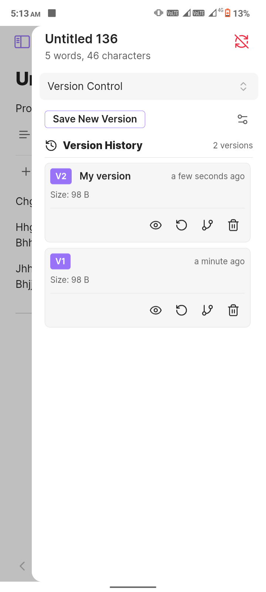
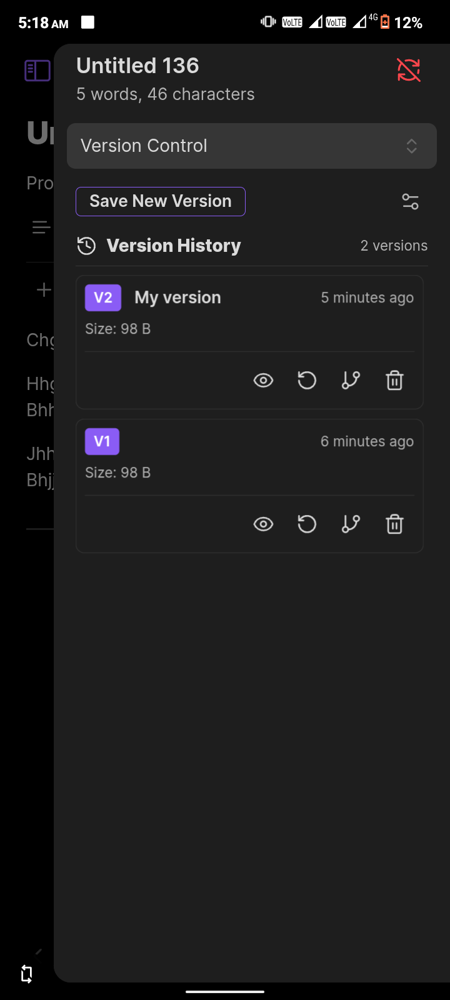
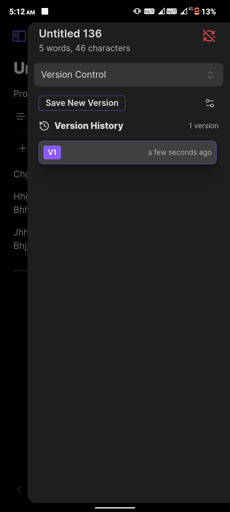

***
So in my work flow I have to constantly modify the same version of the note. I'm a perfectionist at core, that's why I always have to create many variations of the same content until I'm satisfied. But this introduces a problem: Obsidian doesn't have any built-in version control feature, so I made one myself. This plugin lets you create a finite number of versions of any note.

# Version Control for Obsidian

A simple yet powerful versioning system for your Obsidian notes. Never lose a good idea again just because you rewrote a sentence. Create, manage, and restore different versions of your notes right inside Obsidian.

---

### The Interface

The plugin is designed to be intuitive and fit seamlessly with your Obsidian theme, whether you prefer light or dark mode.

<table>
  <tr>
    <td align="center"><strong>Card View (Light)</strong></td>
    <td align="center"><strong>Card View (Dark)</strong></td>
  </tr>
  <tr>
    <td></td>
    <td></td>
  </tr>
  <tr>
    <td align="center"><strong>List View (Light)</strong></td>
    <td align="center"><strong>List View (Dark)</strong></td>
  </tr>
  <tr>
    <td></td>
    <td></td>
  </tr>
</table>

### What Can This Plugin Do For You?

Have you ever been editing a note, trying to perfect it, only to realize you've lost a great paragraph from an earlier draft? Or maybe you want to explore a different angle for your writing without creating a dozen "Copy of..." files?

This plugin solves that. It allows you to save "snapshots" of your notes at any point in time. Think of it like a manual save point in a video game, but for your thoughts. You can create as many versions as you need, give them names, and easily jump back to any previous state.

### Key Features

*   💾 **Save Snapshots:** At any time, save the current state of your note as a new version. You can give it a custom name (e.g., "First Draft," "Added Research Links") for easy reference.

*   👀 **Preview & Restore:** Quickly glance at the content of any old version without commitment. If you like what you see, restore it with a single click. Don't worry—the plugin automatically saves a backup of your current content before restoring!

*   🌿 **Create Deviations:** Found an old version with a brilliant idea you want to explore separately? Create a brand-new note from any version to branch your thoughts without cluttering the original.
  
*   ⚙️ **Smart Cleanup:** Keep your history tidy. Set a maximum number of versions per note, or automatically clean up versions older than a certain number of days.
  
*   📤 **Export Your History:** Need to back up your work or use it elsewhere? Export the entire version history of a note to various formats, including Markdown, JSON, and plain text.

*   💅 **Flexible Interface:** Choose between a detailed **Card View** that shows all actions at a glance, or a sleek, **Compact List View** for a more minimal look.

### How To Get Started

1.  **Open the View:** Click the **History** icon (`⟲`) in the ribbon sidebar to open the Version Control panel.

2.  **Select a Note:** Click on any note in your vault. The panel will now show the context for that note.

3.  **Save Your First Version:** Click the **"Save New Version"** button. If you have version naming enabled, you can give it a name and hit save. That's it! Your first version is saved.

4.  **Interact with History:** As you create more versions, they will appear in the list.
    *   In **Card View**, use the buttons on each version to `View`, `Restore`, or `Delete`.
    *   In **Compact View**, right-click on any version to see all available actions in a context menu.

### Where Are The Settings? 🤔

You can't find a settings tab? Well, there isn't one! I absolutely hate them. You can configure everything you need right from the UI.

Just click the **Settings icon** (`⚙️`) in the top right of the Version Control panel to open the settings overlay. You can toggle features, set cleanup rules, and change the view mode on the fly.

### Shameless Plug 🔌

Do check out my **In-App Builder** plugin that lets you build and bundle your plugins right inside your vault. No external tools needed! Fun fact: this whole plugin was compiled and built by IAB from start to finish.

[IAB](https://github.com/Yuichi-Aragi/IAB)

Bye.
