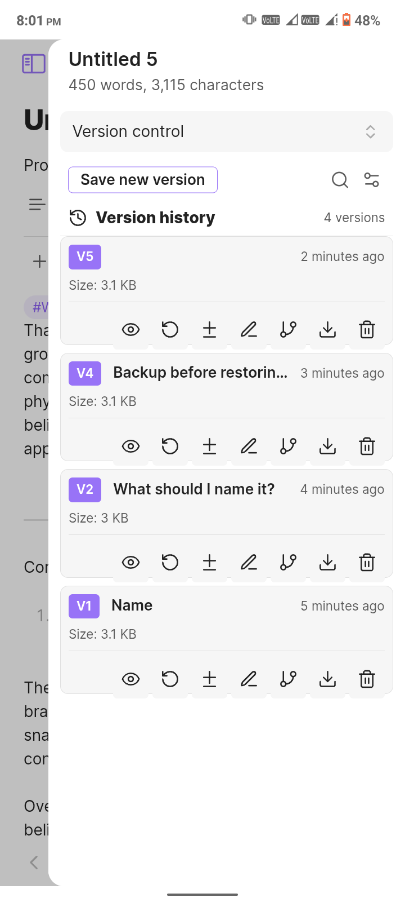
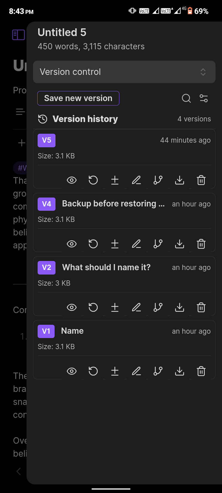
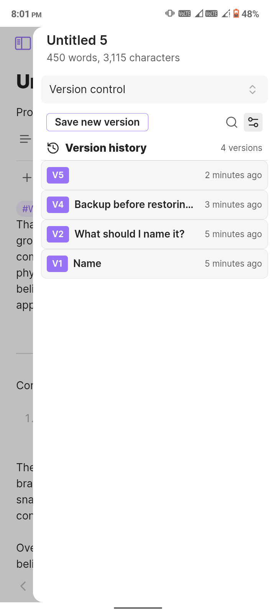
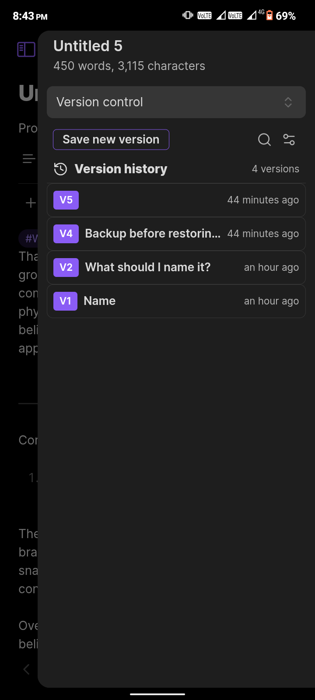

      
***
So in my work flow I have to constantly modify the same version of the note. I'm a perfectionist at core, that's why I always have to create many variations of the same content until I'm satisfied. But this introduces a problem, and i wanted a solution, so I made one myself. This plugin lets you create a finite number of versions of any note.

# Version Control for Obsidian

A simple yet powerful versioning system for your Obsidian notes. Never lose a good idea again just because you rewrote a sentence. Create, manage, and restore different versions of your notes right inside Obsidian.

---

### The Interface

The plugin is designed to be intuitive and fit seamlessly with your Obsidian theme, whether you prefer light or dark mode.

<table>
  <tr>
    <td align="center"><strong>Card View (Light)</strong></td>
    <td align="center"><strong>Card View (Dark)</strong></td>
  </tr>
  <tr>
    <td></td>
    <td></td>
  </tr>
  <tr>
    <td align="center"><strong>List View (Light)</strong></td>
    <td align="center"><strong>List View (Dark)</strong></td>
  </tr>
  <tr>
    <td></td>
    <td></td>
  </tr>
</table>

### What Can This Plugin Do For You?

Have you ever been editing a note, trying to perfect it, only to realize you've lost a great paragraph from an earlier draft? Or maybe you want to explore a different angle for your writing without creating a dozen "Copy of..." files?

This plugin solves that. It allows you to save "snapshots" of your notes at any point in time. Think of it like a manual save point in a video game, but for your thoughts. You can create as many versions as you need, give them names, and easily jump back to any previous state.

### Key Features

*   💾 **Save Snapshots:** At any time, save the current state of your note as a new version. You can give it a custom name (e.g., "First Draft," "Added Research Links") for easy reference.

*   👀 **Preview & Restore:** Quickly glance at the content of any old version without commitment. If you like what you see, restore it with a single click. Don't worry—the plugin automatically saves a backup of your current content before restoring!

*   🔍 **Compare Versions (Diff):** See the exact changes between any two versions of your note, highlighting what was added, removed, or modified. (Obviously!)

*   🌿 **Create Deviations:** Found an old version with a brilliant idea you want to explore separately? Create a brand-new note from any version to branch your thoughts without cluttering the original.
  
*   ⚙️ **Smart Cleanup:** Keep your history tidy. Set a maximum number of versions per note, or automatically clean up versions older than a certain number of days.
  
*   📤 **Export Your History:** Need to back up your work or use it elsewhere? Export the entire version history of a note to various formats, including Markdown, JSON, and plain text.

*   💅 **Flexible Interface:** Choose between a detailed **Card View** that shows all actions at a glance, or a sleek, **Compact List View** for a more minimal look.

### How is this different from Obsidian's File Recovery?

You might be thinking, "Doesn't Obsidian already have a File Recovery plugin?" And you're right! The built-in [File Recovery](https://help.obsidian.md/plugins/file-recovery) is pretty good and useful for most users. But I wanted more control, more features, and a more hands-on approach.

Honestly, as a very anxious person, I don't fully trust a process that happens in the background. I wanted to save a version *when I want to*, not at a set time interval. I wanted to see my version history right there in the sidebar, confirming my changes are saved, instead of having to open the file recovery modal via a command. (Yes, I'm a control freak, I like to be the one in control, any problem with that?) This plugin was born from that need for control and visibility.

Here’s a quick breakdown:

*   **Intentional vs. Automatic:** This plugin is about **manual, intentional snapshots**. You decide the perfect moment to save a version and can give it a meaningful name like "Brainstorming complete" or "Final draft before rewrite." File Recovery works automatically, saving snapshots every few minutes, which is great for accidents but less useful for marking specific creative milestones.

*   **Creative Workflow vs. Disaster Recovery:** This plugin is designed for your **creative workflow**. Features like naming versions, creating new notes from old versions ("deviations"), and easily previewing content are built to help you iterate and explore ideas. File Recovery is a **disaster recovery** tool, designed to help you get back a file you accidentally deleted or overwrote.

*   **Always-On UI vs. On-Demand Modal:** Your note's history is always visible and accessible in the sidebar with this plugin. With File Recovery, you access it through settings or a command when you realize you need to restore something. It's not designed to be part of your constant workflow.

In simple terms, think of it this way:
*   **Obsidian File Recovery:** A fantastic, passive safety net for "oops" moments.
*   **Version Control (This Plugin):** An active, hands-on tool for perfectionists, writers, and anyone who wants to consciously manage the evolution of their ideas.

### How To Get Started

1.  **Open the View:** Click the **History** icon (`⟲`) in the ribbon sidebar to open the Version Control panel.

2.  **Select a Note:** Click on any note in your vault. The panel will now show the context for that note.

3.  **Save Your First Version:** Click the **"Save New Version"** button. If you have version naming enabled, you can give it a name and hit save. That's it! Your first version is saved.

4.  **Interact with History:** As you create more versions, they will appear in the list.
    *   In **Card View**, use the buttons on each version to `View`, `Restore`, or `Delete`.
    *   In **Compact View**, right-click on any version to see all available actions in a context menu.

### Supports

* **Mobile**
* **Desktop**
