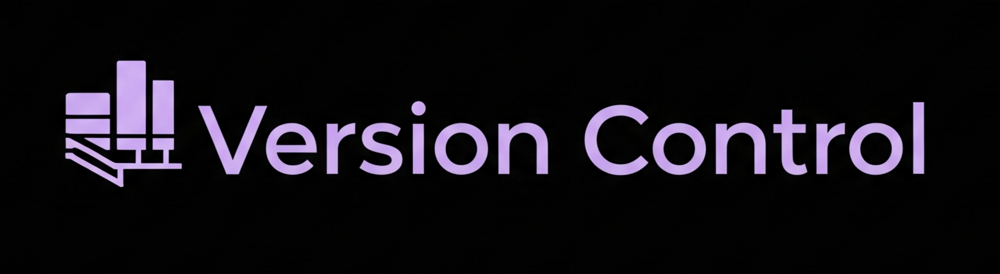
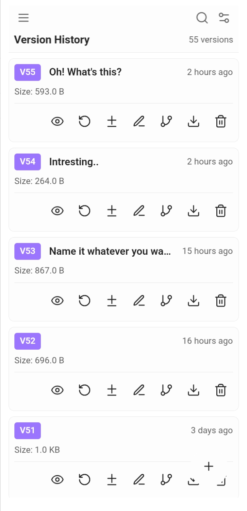
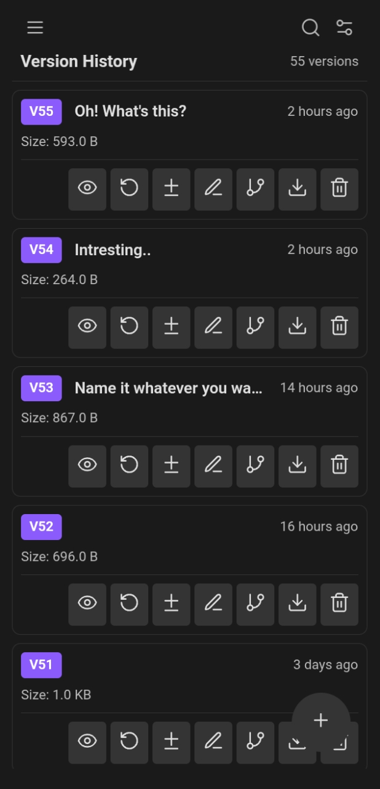
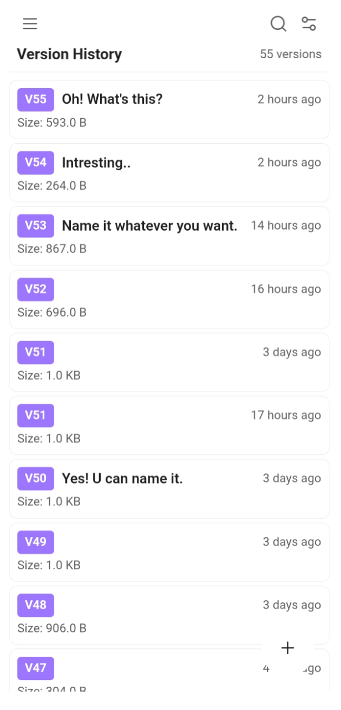
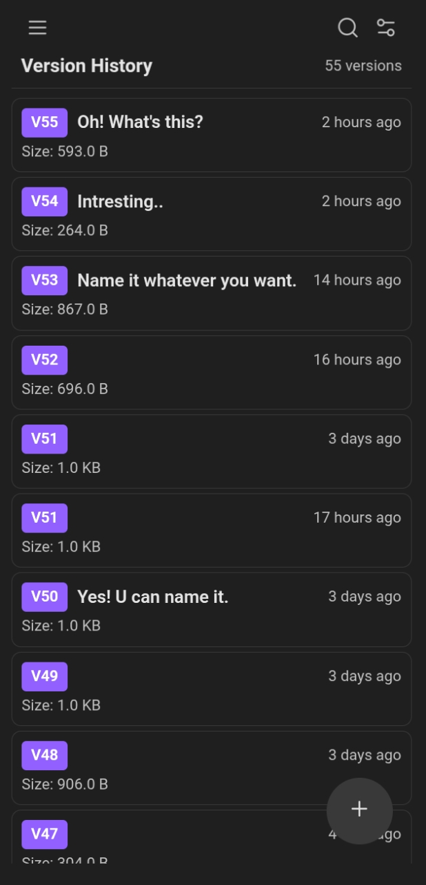

      

***

# Version Control for Obsidian

**Not another Git wrapper. Not automatic backup. This is version control for your *thoughts*.**

If you're a writer, a perfectionist, or someone who iterates through multiple drafts before finding the right words—this plugin was made for you. It's for those moments when you want to save something meaningful, not because a timer went off, but because *you* decided this version is worth keeping.

---

## 🎯 A Different Philosophy

**Git is amazing, but it wasn't designed for writers.** Git treats your entire vault as a single branch, but when you're writing, you don't want to version a folder—you want to version *a note*. A single piece of writing. A specific idea.

**This plugin flips that model:**
- **Git versions folders** → **This plugin versions individual files**
- **Git treats a vault as a branch** → **This plugin treats each note as its own repository**
- **Git makes you leave the file to branch** → **This plugin lets you branch *within* the note**

Think of it this way: you're writing a note about a complex idea. You want to explore two different angles—maybe a technical explanation vs. a philosophical one. With Git, you'd need to create separate files or switch branches. With this plugin, you **branch your thoughts right there in the same note**, each with its own independent history.

---

## 💡 The Core Philosophy: Conscious Milestones

At its heart, this plugin is about **intentionality**—saving versions when **you** decide they're worth saving. When you've reached a milestone. When you've captured something meaningful that you might want to return to later.

- **For perfectionists:** Save each iteration as you refine your ideas, without cluttering your vault with "Copy of..." files.
- **For writers:** Mark meaningful drafts ("First complete thought," "After research," "Final before rewrite") instead of generic timestamps.
- **For thinkers:** Branch your ideas to explore different directions, then merge back what works.

This **intentional** approach to version control is the core philosophy of this plugin—it's designed for people who want to be in control of their creative evolution.

**But we also have your back.** Alongside intentional Version History, this plugin offers an optional **Edit History** feature—automatic, passive snapshots that work in the background as a safety net. You get the best of both worlds: conscious milestones when you want them, and invisible protection when you need it.

---

## 🤝 Works *With* Git, Not Against It

Because this plugin operates at the **file level** (not the vault level), it plays perfectly alongside Git:

- **Use Git** to manage your vault structure, sync across devices, and track large-scale changes
- **Use this plugin** to manage the fine-grained evolution of individual notes, with meaningful milestones and experimental branches

No conflicts. No competition. Two complementary tools for different scales of version control.

---

## 📝 What This Plugin Supports

As of now, this plugin provides version control for:

- ✅ **Markdown files (`.md`)** – Your notes, your writing, your ideas
- ✅ **Obsidian Bases (`.base`)** – Yes, these too!
- 🔜 **Canvas files (`.canvas`)** – Planned for future releases

---

## 🚀 Key Features That Transform Your Workflow

### 💾 **Save Intentional Snapshots**
Create meaningful version milestones with custom names and descriptions. Save "First complete thought," "After research," "Final before rewrite" – exactly when YOU decide it's worth preserving.

### 👀 **Preview & Restore with Confidence**
Quickly glance at any old version's content without leaving your current file. When you find something you want, restore it with a single click. The plugin automatically saves a backup of your current content before restoring, so you can experiment fearlessly.

### 🔍 **Advanced Comparison (Diff) Engine**
See exactly what changed between any two versions with multiple comparison modes:
- **Line Diff**: Traditional line-by-line comparison
- **Word Diff**: See exactly which words changed
- **Character Diff**: Catch even the smallest modifications
- **Smart Diff**: Intelligent comparison that understands context
- **Panel or Window View**: Choose how you want to review changes

### 🌿 **Create Deviations (New Notes)**
Turn any old version into a completely separate file. Perfect for major rewrites, spin-off ideas, or exploring completely different directions without losing your original work.

### 🌳 **Branch Within the Same Note**
Need to try a different direction within the *same file*? Create branches to work on parallel ideas. Each branch has its own independent history, so you can experiment freely without affecting your main draft.

### ⏱️ **Dual History System**
**Version History** (intentional snapshots you control) + **Edit History** (automatic background protection). Choose what works best for your workflow—or use both for maximum flexibility.

### 📊 **Timeline View**
See your note's evolution as a chronological list with:
- Event cards showing version history (intentional) vs edit history (automatic)
- Expandable details showing exactly what changed between versions
- Search functionality to find specific changes or time periods
- Combined or separate views of Version and Edit history

### 🧹 **Smart Management**
Keep your history tidy with intelligent cleanup, bulk operations, and customizable retention policies that preserve important milestones while managing storage efficiently.

### 📤 **Export Your History**
Export your work in multiple formats:
- **Markdown**: Human-readable format that works anywhere
- **JSON**: Structured data for programmatic use
- **NDJSON**: Streaming JSON format for large datasets
- **Plain Text**: Simple text format

### 🎨 **Flexible Interface**
Choose between viewing modes that fit your workflow:
- **Card View**: Rich cards showing all version details at a glance
- **List View**: Compact, minimal interface for focused work
- **Dark/Light Mode**: Automatically adapts to your Obsidian theme
- **Customizable Display**: Show/hide names, descriptions, timestamps, and statistics

### ⚙️ **Granular Settings & Automation**
Customize every aspect with global or per-note settings:
- **Auto-save settings**: Save versions automatically on file save or at intervals
- **Smart triggers**: Save only when significant changes occur (word count, line count, character count)
- **Watch mode**: Background monitoring with customizable intervals
- **Path filtering**: Automatically register or exclude notes based on file paths

### 📱 **Mobile-First Design**
Unlike Git, this plugin works seamlessly across all your devices with full feature parity, touch-optimized interface, and responsive design that adapts to any screen size.

### 🔒 **Privacy & Data Control**
Your data stays yours with local storage only, portable Markdown format, persistent data that survives plugin removal, and optional compression for space efficiency.

---

## The Interface

The plugin is designed to be intuitive and fit seamlessly with your Obsidian theme, whether you prefer light or dark mode.

<table>
  <tr>
    <td align="center"><strong>Card View (Light)</strong></td>
    <td align="center"><strong>Card View (Dark)</strong></td>
  </tr>
  <tr>
    <td></td>
    <td></td>
  </tr>
  <tr>
    <td align="center"><strong>List View (Light)</strong></td>
    <td align="center"><strong>List View (Dark)</strong></td>
  </tr>
  <tr>
    <td></td>
    <td></td>
  </tr>
</table>

---

## How is this different from Obsidian's File Recovery?

**Obsidian File Recovery:** A basic, passive safety net for "oops" moments.

**Version Control (This Plugin):** A comprehensive toolkit—intentional milestones for your creative workflow *plus* automatic edit tracking for peace of mind.

Here's the key differences:

| Aspect | File Recovery | This Plugin |
|--------|---------------|-------------|
| **Control** | Automatic snapshots only | Manual, intentional milestones + automatic protection |
| **Naming** | No custom names | Meaningful names like "Brainstorming complete" |
| **UI** | Hidden modal | Always-visible sidebar interface |
| **Purpose** | Disaster recovery | Creative workflow enhancement |
| **Features** | Basic restore | Branching, diffing, timeline, export, deviations |
| **Visibility** | On-demand | Integrated into your daily workflow |

---

## Two Types of History

This plugin offers two complementary approaches:

### 🎯 **Version History** (Intentional Snapshots)
- **When**: Only when you explicitly choose to save
- **Purpose**: Creative milestones and meaningful drafts
- **Storage**: `.versiondb` folder (in your vault)
- **Format**: Full Markdown copies
- **Best for**: Perfectionists and conscious creators

### ⏱️ **Edit History** (Automatic Snapshots)
- **When**: Based on your settings (file save, intervals, change thresholds)
- **Purpose**: Safety net and session recovery
- **Storage**: IndexedDB (browser database)
- **Format**: Compressed diffs (space-efficient)
- **Best for**: "Oops" moments and seeing how you evolved

**The key insight:** When you're writing, you don't want to version a folder—you want to version *a thought*. This plugin gives you that focused control.

---

## Quick Start Guide

For immediate use:

1. **Save your first version**: Click the `+` button in the bottom-right corner
2. **Switch between histories**: Click "Version History" or "Edit History" in the header
3. **Access settings**: Click the gear icon in the top-right corner
4. **View timeline**: Click the menu button (☰) → "Timeline"
5. **Create branches**: Click the menu button (☰) → "Branches"

---

## Platform Support

* ✅ **Mobile** (iOS & Android)
* ✅ **Desktop** (Windows, macOS, Linux)

---

## Download

To jump straight to the Version Control plugin in Obsidian, try this:

* **​Click the URI:** Copy and paste or click this [link](obsidian://show-plugin?id=version-control), which should launch the app: obsidian://show-plugin?id=version-control
* **Alternatively (Search):** If the link doesn't work, go to your Obsidian Settings and search for 'Version-Control' in the Community Plugins list.

---

## Final Thoughts

This plugin was born from my own workflow frustrations. As someone who constantly modifies and perfects the same note, creating many variations until I'm satisfied, I needed a solution that gave me control. Not vault-wide version tracking. Not hidden modals. Just simple, intentional milestones for my ideas—with the option for automatic protection when I want it.

If that resonates with you—if you're someone who wants to consciously manage how your thoughts evolve, while also having a safety net for those inevitable "oops" moments—then this plugin might be exactly what you need.

***

*Made with ❤️ for writers, perfectionists, and conscious creators.*
