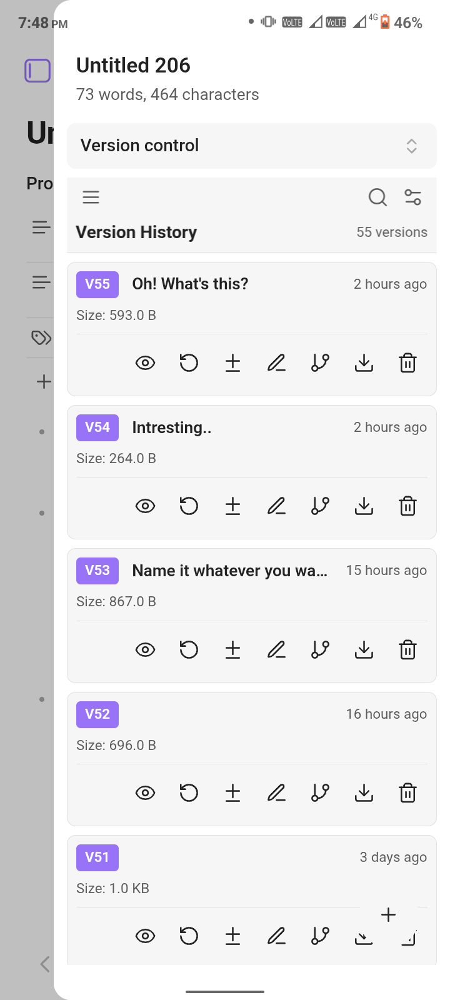
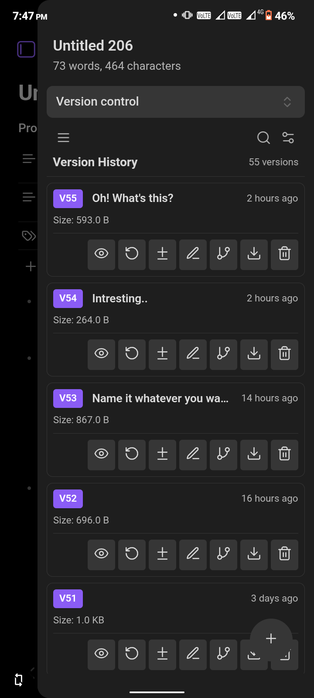
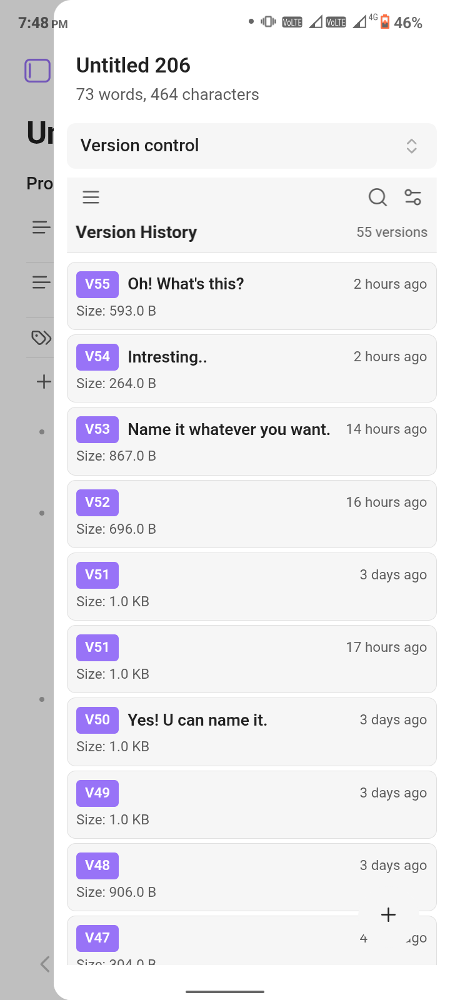
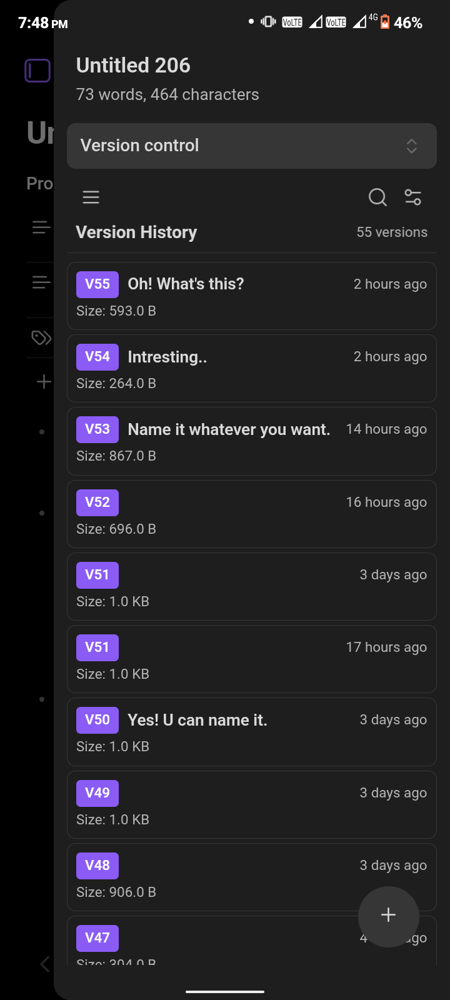

      

***
So in my work flow I have to constantly modify the same version of the note. I'm a perfectionist at core, that's why I always have to create many variations of the same content until I'm satisfied. But this introduces a problem, and i wanted a solution, so I made one myself. This plugin lets you create a finite number of versions of any note.

# Version Control for Obsidian

A simple yet powerful versioning system for your Obsidian notes. Never lose a good idea again just because you rewrote a sentence. Create, manage, and restore different versions of your notes right inside Obsidian.

### Why Choose This Plugin?

This plugin is designed for writers, thinkers, and perfectionists who want a simple, intuitive, and robust way to manage the evolution of their notes. If you've ever found yourself creating multiple copies of a file just to explore a new idea, or wished you could go back to a previous version of a paragraph, this plugin is for you.

*   **Per-File Version Control:** Unlike Git, which versions your entire vault, this plugin focuses on individual notes. This means you can track the history of a single piece of writing without the complexity of commits, branches, or repositories.
*   **Simplicity and Intuition:** If you find Git's learning curve steep or its features excessive for your needs, this plugin offers a straightforward alternative. It's designed to "just work" out of the box, with a clear and accessible interface.
*   **Mobile-Friendly:** Running a full Git client on mobile or tablets can be impractical. This plugin provides a reliable, self-contained versioning system that works seamlessly across all your devices, including mobile.
*   **Plays Well with Others:** You can use this plugin alongside Git without any conflicts. Let Git manage your overall vault structure and synchronization, while this plugin handles the fine-grained versioning of your individual notes.

---

### The Interface

The plugin is designed to be intuitive and fit seamlessly with your Obsidian theme, whether you prefer light or dark mode.

<table>
  <tr>
    <td align="center"><strong>Card View (Light)</strong></td>
    <td align="center"><strong>Card View (Dark)</strong></td>
  </tr>
  <tr>
    <td></td>
    <td></td>
  </tr>
  <tr>
    <td align="center"><strong>List View (Light)</strong></td>
    <td align="center"><strong>List View (Dark)</strong></td>
  </tr>
  <tr>
    <td></td>
    <td></td>
  </tr>
</table>

### What Can This Plugin Do For You?

Have you ever been editing a note, trying to perfect it, only to realize you've lost a great paragraph from an earlier draft? Or maybe you want to explore a different angle for your writing without creating a dozen "Copy of..." files?

This plugin solves that. It allows you to save "snapshots" of your notes at any point in time. Think of it like a manual save point in a video game, but for your thoughts. You can create as many versions as you need, give them names, and easily jump back to any previous state.

***

### Key Features

*   💾 **Save Snapshots:** At any time, save the current state of your note as a new version. You can give it a custom name (e.g., "First Draft," "Added Research Links") for easy reference.

*   👀 **Preview & Restore:** Quickly glance at the content of any old version without commitment. If you like what you see, restore it with a single click. Don't worry—the plugin automatically saves a backup of your current content before restoring!

*   🔍 **Advanced Comparison (Diff):** See exactly what changed between any two versions. Go beyond standard line-by-line comparison with advanced modes like **Word**, **Character**, and **JSON Diff** to pinpoint every modification.

*   🌿 **Create Deviations (New Note):** Want to turn an old version into a completely separate file? Create a "deviation" to start a brand-new note from any point in your history, perfect for major rewrites or spin-off ideas.

*   🌳 **Explore with Branches (Same Note):** Need to try a different direction within the *same file*? Create a "branch" to work on parallel ideas. Each branch has its own independent history, so you can experiment freely without affecting your main draft.

*   ⚙️ **Smart Cleanup:** Keep your history tidy. Set a maximum number of versions per note, or automatically clean up versions older than a certain number of days.

*   📤 **Export Your History:** Need to back up your work or use it elsewhere? Export the entire version history of a note to various formats, including Markdown, JSON, and plain text.

*   💅 **Flexible Interface:** Choose between a detailed **Card View** that shows all actions at a glance, or a sleek, **Compact List View** for a more minimal look.

### **Supports Version Control For:**

* **Markdown files (notes)**
* **Bases**

### How is this different from Obsidian's File Recovery?

You might be thinking, "Doesn't Obsidian already have a File Recovery plugin?" And you're right! The built-in [File Recovery](https://help.obsidian.md/plugins/file-recovery) is pretty good and useful for most users. But I wanted more control, more features, and a more hands-on approach.

Honestly, as a very anxious person, I don't fully trust a process that happens in the background. I wanted to save a version *when I want to*, not at a set time interval. I wanted to see my version history right there in the sidebar, confirming my changes are saved, instead of having to open the file recovery modal via a command. (Yes, I'm a control freak, I like to be the one in control, any problem with that?) This plugin was born from that need for control and visibility.

Here’s a quick breakdown:

*   **Intentional vs. Automatic:** This plugin is about **manual, intentional snapshots**. You decide the perfect moment to save a version and can give it a meaningful name like "Brainstorming complete" or "Final draft before rewrite." File Recovery works automatically, saving snapshots every few minutes, which is great for accidents but less useful for marking specific creative milestones.

*   **Creative Workflow vs. Disaster Recovery:** This plugin is designed for your **creative workflow**. Features like naming versions, creating new notes from old versions ("deviations"), and easily previewing content are built to help you iterate and explore ideas. File Recovery is a **disaster recovery** tool, designed to help you get back a file you accidentally deleted or overwrote.

*   **Always-On UI vs. On-Demand Modal:** Your note's history is always visible and accessible in the sidebar with this plugin. With File Recovery, you access it through settings or a command when you realize you need to restore something. It's not designed to be part of your constant workflow.

In simple terms, think of it this way:
*   **Obsidian File Recovery:** A fantastic, passive safety net for "oops" moments.
*   **Version Control (This Plugin):** An active, hands-on tool for perfectionists, writers, and anyone who wants to consciously manage the evolution of their ideas.

### Data Storage and Persistence

**Your data stays with you.** All version history data is stored locally within your Obsidian vault in a hidden folder (specifically, a folder named `.versiondb`). Inside this folder, the data for each version is saved as standard Markdown (`.md`) files.

This structure ensures data persistence and privacy:
*   **Local Storage:** Your version history never leaves your vault or connects to an external service.
*   **Data Stays:** Your version history and all associated data will remain in your vault even if you uninstall or remove the plugin.
*   **Accessible Format:** Because it is stored as standard Markdown files, your data is always accessible and readable, even without the plugin.

### Supports

* **Mobile**
* **Desktop**

### Download

To jump straight to the Version Control plugin in Obsidian, try this:

* **​Click the URI:** Copy and paste or click this [link](obsidian://show-plugin?id=version-control), which should launch the app: obsidian://show-plugin?id=version-control
* **Alternatively (Search):** If the link doesn't work, go to your Obsidian Settings and search for 'Version-Control' in the Community Plugins list.
